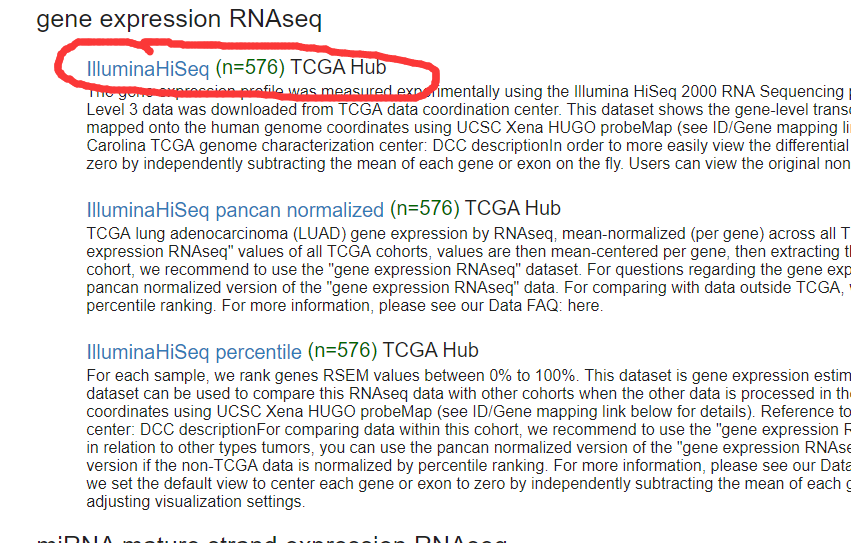

* 需求记录
 lao po 2020/10/04 10:10:45
你先帮我把昨天跟你说的癌症标记代码实现了
up 2020/10/04 10:10:55
 lao po 2020/10/04 10:11:28
就标记癌症和正常两个类别，癌症名称是压缩包的名称，可以用括号里面那个缩写
 lao po 2020/10/04 10:12:12
 
我下载的是HiSeq这个
 lao po 2020/10/04 10:12:26
顺便写个解压功能
 lao po 2020/10/04 10:12:33
不用每个下载的压缩包手动解压
 lao po 2020/10/04 10:12:37

* 需求整理
读取下载的.gz文件，解压转换为类似arff格式文件，标记出癌症和正常两个类别

